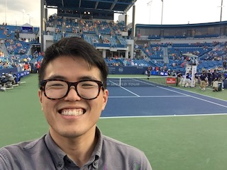

# Jaeho Lee
I am a postdoc at the [algorithmic intelligence laboratory](http://alinlab.kaist.ac.kr) at KAIST, working with [Jinwoo Shin](http://alinlab.kaist.ac.kr/shin.html) (mandatory military service:-- ending February 2022).

Before joining here, I completed my Ph.D. under the guidance of [Maxim Raginsky](http://maxim.ece.illinois.edu), in the middle of the lovely cornfields of [Urbana-Champaign](https://illinois.edu). Even prior to this, I was an undergraduate student at KAIST, double-majoring the electrical engineering and the management science.

My research focuses on analyzing the impact of operational constraints on the generalization/approximation capabilities of learning algorithms; the constraints may be about robustness, fairness, risk-sensitivity, or sparsity. As a research tool, I like to use the machineries from the statistical learning theory (all hail Vapnik!), high-dimensional statistics, and computational libraries for machine learning.

For any inquiries (or CV), please contact me via email: jaeho-lee [at] kaist [dot] ac [dot] kr. I may respond even faster via Twitter: [@jaeho_lee_](https://twitter.com/jaeho_lee_)

(I don't update Google scholar too often, but here's a [link](https://scholar.google.com/citations?hl=en&user=t91zoQMAAAAJ&view_op=list_works&sortby=pubdate).)

  

<!---
### education
* Ph.D. in ECE@UIUC, May 2019 (advisor: [Maxim Raginsky](http://maxim.ece.illinois.edu) [[photo]](assets/max_and_i.jpg)).
	* Thesis title: Robustness and generalization guarantees for statistical learning of generative models.
* M.S. in ECE@UIUC, December 2015.
* B.S. in EE+MS@KAIST with *summa cum laude*, February 2013 (advisor: [Yung Yi](http://lanada.kaist.ac.kr/~yi/))
-->
## papers

**Co2L: Contrastive continual learning**  
Hyuntak Cha, **JL**, and Jinwoo Shin  
Preprint, 2021.  

**[Provable memorization via deep neural networks using sub-linear parameters](https://arxiv.org/abs/2010.13363)**  
Sejun Park, **JL**, Chulhee Yun, and Jinwoo Shin  
Preprint, 2020.  
([Sejun](https://sites.google.com/site/sejunparksite/) gave a 20-min talk at [Deepmath 2020](https://deepmath-conference.com): here's a [video](https://www.youtube.com/watch?v=NHCfKFz3IeU))  

**[Layer-adaptive sparsity for the magnitude-based pruning](https://openreview.net/forum?id=H6ATjJ0TKdf)**  
**JL**, Sejun Park, Sangwoo Mo, Sungsoo Ahn, and Jinwoo Shin  
ICLR 2021.

**[Minimum width for universal approximation](https://openreview.net/forum?id=O-XJwyoIF-k)**  
Sejun Park, Chulhee Yun, **JL**, and Jinwoo Shin  
ICLR 2021.  
([Sejun](https://sites.google.com/site/sejunparksite/) gave a talk at [Deepmath 2020](https://deepmath-conference.com): here's a [video](https://www.youtube.com/watch?v=NHCfKFz3IeU))  

**[MASKER: Masked Keyword Regularization for Reliable Text Classification](https://arxiv.org/abs/2012.09392)**  
{Seung Jun Moon, Sangwoo Mo}equal, Kimin Lee, **JL**, and Jinwoo Shin  
AAAI, 2021.  

**[Learning bounds for risk-sensitive learning](https://proceedings.neurips.cc/paper/2020/hash/9f60ab2b55468f104055b16df8f69e81-Abstract.html)**  
**JL**, Sejun Park, and Jinwoo Shin  
NeurIPS 2020.  
\[[code](https://github.com/jaeho-lee/oce) | [slide](https://www.slideshare.net/ALINLAB/learning-bounds-for-risksensitive-learning) | [poster](assets/oce_poster.pdf)\]

**[Learning from failure: Training debiased classifier from biased classifier](https://proceedings.neurips.cc/paper/2020/hash/eddc3427c5d77843c2253f1e799fe933-Abstract.html)**  
Junhyun Nam, Hyuntak Cha, Sungsoo Ahn, **JL**, and Jinwoo Shin  
NeurIPS 2020.

**[Lookahead: A far-sighted alternative of magnitude-based pruning](https://openreview.net/forum?id=ryl3ygHYDB)**  
{Sejun Park, **JL**}equal, Sangwoo Mo, and Jinwoo Shin  
ICLR 2020.

**[Learning finite-dimensional coding schemes with nonlinear reconstruction maps](https://epubs.siam.org/doi/abs/10.1137/18M1234461)**  
**JL** and Maxim Raginsky  
SIMODS 2019.

**[Minimax statistical learning with Wasserstein distances](https://proceedings.neurips.cc/paper/2018/hash/ea8fcd92d59581717e06eb187f10666d-Abstract.html)**  
**JL** and Maxim Raginsky  
NeurIPS 2018.  
\[[spotlight talk](https://www.videoken.com/embed/h-nWXfuEpF4?tocitem=38)\]

**[On MMSE estimation from quantized observations in the nonasymptotic regime](https://ieeexplore.ieee.org/document/7282992)**  
**JL**, Maxim Raginsky, and Pierre Moulin  
ISIT 2015.

  

## teaching
* TA, ECE563 [Information theory](http://maxim.ece.illinois.edu/teaching/fall17/index.html), UIUC, Fall 2017.
* TA, ECE498 [Introduction to stochastic systems](https://courses.engr.illinois.edu/ece498mr/sp2017/), UIUC, Spring 2017.
* TA, ECE598 [Statistical learning theory](http://maxim.ece.illinois.edu/teaching/fall15b/index.html), UIUC, Fall 2015.

  

## invited talks
* "Learning bounds for risk-sensitive learning," Spotlight @ NeurIPS social: ML in Korea, Dec 2020.
* "A deeper look at the layerwise sparsity of magnitude-based pruning," Sparsity reading group @ Google (informal), Nov 2020.
* "Lookahead: A far-sighted alternative of magnitue-based pruning," Spotlight @ ICLR social: ML researchers in/interested in Korea, May 2020.
* "Minimax Statistical Learning with Wasserstein distances," IFORS, ~~June 2020~~ (postponed to 2021, due to COVID-19).
* "Statistical learning perspectives on neural nets (and pruning them)," Postech CS Seminar, December 2019.
* "Minimax Statistical Learning with Wasserstein distances," INFORMS annual meeting, October 2019.
* "Minimax Learning: with implications on domain adaptation and adversarial attack," Naver Tech Talk, January 2019.

  

## honors & awards
* Travel awards: ISIT 2015, NeurIPS 2018, University of Illinois Graduate College Fall 2018.
* ASAN fellow 2013.
* Summa Cum Laude, KAIST, 2013.
* National Science and Engineering Undergraduate Scholarship, Korea, 2009–2012.

  

## refereeing
* Conferences: {ACML, NeurIPS, ICML, AISTATS}2019, {AAAI, ICML, AISTATS, IJCAI, NeurIPS}2020, {ICLR, AAAI, AISTATS, ICML}2021.
* Journals: {Machine Learning, IEEE ToN}.

  

## miscellaneous
* I recently started catching up the MD4SG literature; find me at the [MD4SG Asia-Pacific working group](http://md4sg.com/workinggroups/asiapacific.html)!
* I worked as an [ASAN fellow](https://www.asanacademy.org/kor/main/index.php) at [The Heritage Foundation](https://www.heritage.org), from May to July 2013,
	* where I worked with [James Sherk](https://www.heritage.org/staff/james-sherk) and [Salim Furth](https://www.heritage.org/staff/salim-furth),
	* wrote [this article](https://www.dailysignal.com/2013/06/25/greece-austerity-doesnt-involve-public-sector-layoffs/) on Greek austerity policies,
	* and assisted a preparation of [this testimony](https://www.budget.senate.gov/imo/media/doc/FURTH%20Testimony%2006-04-13.pdf) before the committee on the budget of U.S. Senate.
* I was a founder-librarian at **Urbana nanolibrary** (now defunct), where I lent 300+ books to 40+ members, from December 2013 to August 2018.

  

(last updated: January 13, 2020.)